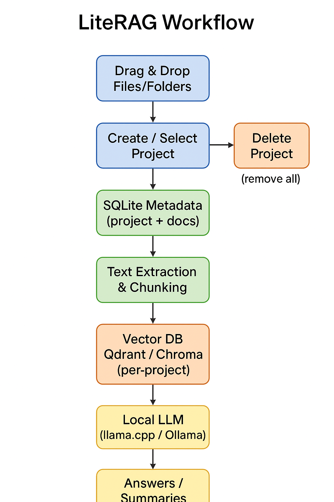

# 🖥️ LiteRAG — Local RAG Desktop App, Production-Ready on Your Own Hardware

> **Goal**: Transform the original Local RAG prototype from my HandsOnLLMs repo into a **scalable, user-ready desktop application** — running entirely offline, with a simple native UI for Linux PCs and laptops. No cloud. No hassle. No ML expertise required.
> **Built for me**: LiteRAG is designed to be a **fast, private, production-ready personal knowledge assistant** that can handle multiple document projects seamlessly.

---

## 🔄 LiteRAG Workflow

**Visual Overview:** Drag & drop → Project → Vector DB → LLM → Answers.

<p align="center">
  
</p>

**How it works**:

1. **Drag & Drop** → initialize a project or add documents.
2. **SQLite** stores metadata and project info.
3. **Text Extraction & Chunking** prepares files for embedding.
4. **Embedding Generation** converts text into vectors.
5. **Qdrant/Chroma** stores vectors per project for semantic search.
6. **Local LLM** processes retrieved chunks and generates answers.
7. **Delete Project** cleans all files, embeddings, and metadata.

---

## 📝 Why I Built This

I work with a lot of private datasets — documents, research papers, code, notes — and I wanted a **single, reliable desktop app** that could:

* Organize content into **separate projects** (e.g., Code, History, Math).
* Allow users to **drag & drop files** to initialize new projects instantly.
* Search files semantically, not just by keyword.
* Summarize and answer questions in natural language.
* Run **completely offline**, without risking data leaks.
* Be **lightweight and fast**, capable of running on laptops without a GPU.
* Provide a **clean, native UI** instead of a clunky browser tab.
* Let users **delete projects cleanly** or expand them anytime.

LiteRAG started as my own daily driver and now provides a **production-ready RAG library experience** for everyone.

---

## 🔄 From *HandsOnLLMs* → **LiteRAG**

LiteRAG is **not a fork** — it’s the evolution of my HandsOnLLMs **Local RAG** prototype:

* **Then**: CLI-only prototype for experimentation.
* **Now**: Full native desktop app with **project-based document management**, embedded vector DB, and GPU/CPU-optimized models.

Key upgrades:

* **Native PySide6 UI** for smooth desktop experience.
* **FastAPI backend** running locally for RAG processing.
* **Lightweight vector DB** (Qdrant or Chroma) with per-project collections.
* **Real-time CPU & GPU inference**.
* **One-click installers** (`.AppImage` / `.deb`) for Linux.
* Full **CLI pipelines** for developers.

---

## 🧩 What Is LiteRAG?

LiteRAG is a **modular, offline Retrieval-Augmented Generation (RAG) desktop app**.
It acts as a **personal knowledge library**, allowing users to:

* 🔹 Create **multiple projects** for different subjects or datasets.
* 🔹 Drag & drop documents to **initialize new projects instantly**.
* 🔹 Expand projects by adding more documents at any time.
* 🔹 Ask questions **per project** or globally across all projects.
* 🔹 Delete projects cleanly — removing all associated files, embeddings, and metadata.

Other features:

* 🔌 **Modular architecture** — swap embedding models or LLMs with config changes.
* 🛡 **100% local execution** — no cloud, no vendor lock-in.
* ⚡ **Small but capable models** — Mistral 7B, Gemma, TinyLlama (quantized) for real-time inference.
* 📂 **Embedded vector DB** — Qdrant or Chroma for fast retrieval.
* 👤 **Personal-first design** — built to be my own daily driver before sharing.

---

## 📁 Folder Structure

```bash
LiteRAG/
├── ui/                # PySide6 UI components
├── backend/           # FastAPI RAG backend
│   ├── embeddings/    # Embedding model logic
│   ├── inference/     # llama.cpp, Ollama integration
│   ├── retrieval/     # Qdrant/Chroma integration
│   ├── utils/         # Parsing, chunking, logging
│   └── config/        # YAML configs
├── models/            # Local LLMs & embedding models
├── installer/         # Auto-start scripts & packaging
├── vector_store/      # Local Qdrant/Chroma data (per-project collections)
├── projects/          # User projects with uploaded documents
├── main.py            # App entry point
└── README.md
```

---

## 🎯 How Users Interact (No Terminal Needed)

1. Launch the app via `.AppImage` or `.deb`.
2. Drag & drop a folder or documents to **create a new project**.
3. Name the project and start uploading content.
4. Click a project to **chat or search** within it.
5. Add more documents to expand the project at any time.
6. Delete projects to **remove all associated files and embeddings** instantly.

> LiteRAG makes managing multiple knowledge projects **as easy as dragging files**.

---

## 🛠 How Developers Interact (CLI Power Mode)

```bash
# Chunk & preprocess docs
python backend/rag_pipeline.py data --file mydoc.pdf --project-id 1

# Embed with specific model
python backend/rag_pipeline.py embed --model-key bge-small-en-v1.5 --project-id 1

# Run local inference
python backend/rag_pipeline.py inf --device cpu --project-id 1

# Full RAG pipeline
python backend/rag_pipeline.py all --file mydoc.pdf --chunk-size 512 --model-key bge-small-en-v1.5 --device cpu --project-id 1
```

---

## 🧪 Tech Stack

| Component       | Tool / Model                         |
| --------------- | ------------------------------------ |
| **UI**          | PySide6 (Qt for Python)              |
| **Backend**     | FastAPI (local server)               |
| **Embeddings**  | BGE-small, MiniLM, Instructor-XL     |
| **Vector DB**   | Qdrant (embedded) / Chroma           |
| **LLM Runtime** | llama.cpp / Ollama                   |
| **Doc Parsing** | pymupdf, unstructured                |
| **DB**          | SQLite (project & document metadata) |
| **Packaging**   | PyInstaller + AppImageKit            |
| **Monitoring**  | (Optional) Prometheus + Grafana      |

---

## 💡 TL;DR

LiteRAG = **Local RAG + Personal Library, done right**.

* Users can **create, expand, and delete projects** with drag & drop.
* Each project has its own **documents, embeddings, and metadata**.
* Fully offline, fast, and lightweight.
* For developers: **full CLI control**.
* For everyone: **instant, offline document QA across multiple projects**.

---

## 📜 Credits & License

* Original repo: **HandsOnLLMs**
* License: MIT © 2025 @silvaxxx1
* Thanks to the open-source community: sentence-transformers, Qdrant, Chroma, llama.cpp, Mistral, Gemma.

---

